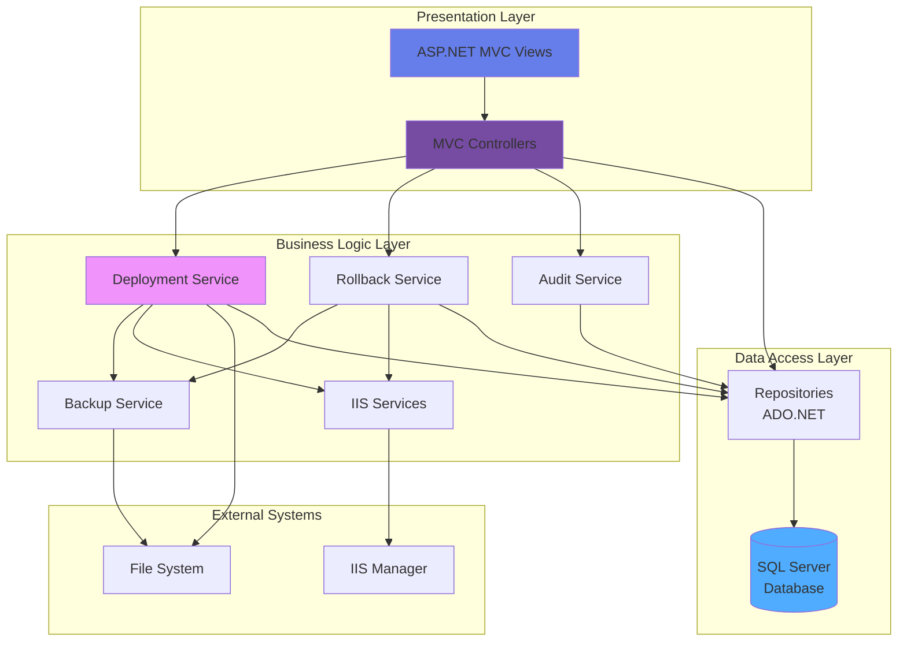
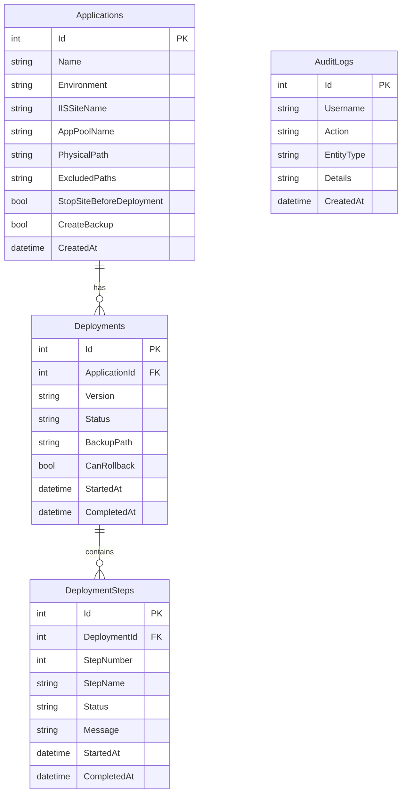
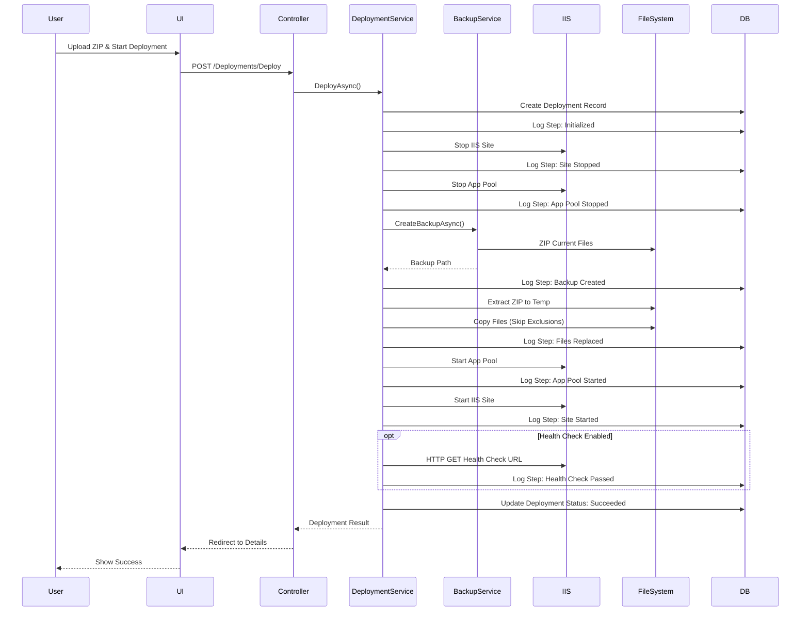
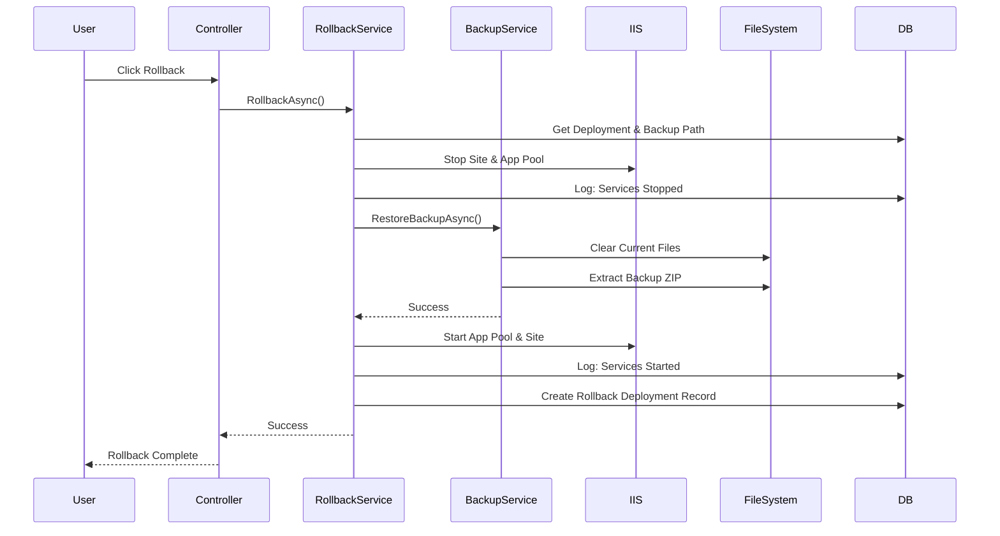
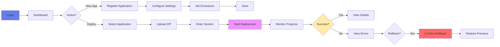

# ReleaseFlow

**Enterprise IIS Deployment Management System**

ReleaseFlow is a modern ASP.NET Core MVC application designed to streamline and automate IIS application deployments with comprehensive monitoring, rollback capabilities, and audit trails.


---

## 🎯 Key Features

- **🚀 Automated Deployments** - One-click deployment with configurable pre/post actions
- **🔄 Smart Rollback** - Instant rollback to previous versions with automatic backup restoration
- **📊 Real-time Monitoring** - Live deployment progress with Azure DevOps-style console output
- **🔍 IIS Auto-Discovery** - Automatically detect and register IIS applications
- **📝 Audit Trail** - Complete deployment history with detailed step-by-step logs
- **⚙️ Flexible Configuration** - Per-application deployment settings and exclusions
- **🎨 Modern UI** - Beautiful, responsive interface with Bootstrap 5 and custom gradients

---

## 🏗️ Architecture

### High-Level Architecture



### Technology Stack

| Layer | Technology |
|-------|-----------|
| **Frontend** | ASP.NET Core MVC, Bootstrap 5, Bootstrap Icons |
| **Backend** | .NET 8, C# 12 |
| **Data Access** | ADO.NET (Raw SQL) |
| **Database** | SQL Server 2019+ |
| **IIS Management** | Microsoft.Web.Administration |
| **Logging** | Serilog (File + Database) |
| **Grid** | NonFactors MVC Grid |

---

## 📊 Database Schema



---

## 🔄 Deployment Flow

### Standard Deployment Process



### Rollback Flow



---

## 🎨 Application Flow

### User Journey: Deploy Application



---

## 📁 Project Structure

```
ReleaseFlow/
├── Controllers/           # MVC Controllers
│   ├── ApplicationsController.cs
│   ├── DeploymentsController.cs
│   ├── AppPoolsController.cs
│   └── AuditController.cs
├── Services/             # Business Logic
│   ├── Deployment/
│   │   ├── DeploymentService.cs
│   │   ├── RollbackService.cs
│   │   └── BackupService.cs
│   ├── IIS/
│   │   ├── SiteService.cs
│   │   ├── AppPoolService.cs
│   │   └── IISDiscoveryService.cs
│   └── AuditService.cs
├── Data/                 # Data Access Layer
│   ├── Repositories/
│   │   ├── ApplicationRepository.cs
│   │   ├── DeploymentRepository.cs
│   │   └── AuditLogRepository.cs
│   └── SqlHelper.cs
├── Models/               # Domain Models
│   ├── Application.cs
│   ├── Deployment.cs
│   ├── DeploymentStep.cs
│   └── AuditLog.cs
├── Views/                # Razor Views
│   ├── Applications/
│   ├── Deployments/
│   ├── AppPools/
│   └── Shared/
└── wwwroot/             # Static Files
    ├── css/
    └── js/
```

---

## 🚀 Getting Started

### Prerequisites

- .NET 8 SDK
- SQL Server 2019+
- IIS 10+ (Windows Server 2016+)
- Administrator privileges (for IIS management)

### Installation

1. **Clone the repository**
   ```bash
   git clone https://github.com/yourusername/ReleaseFlow.git
   cd ReleaseFlow
   ```

2. **Configure database connection**
   ```json
   // appsettings.json
   {
     "ConnectionStrings": {
       "DefaultConnection": "Server=localhost;Database=ReleaseFlowDB;Trusted_Connection=True;TrustServerCertificate=True;"
     }
   }
   ```

3. **Create database**
   ```bash
   # Run database creation script
   sqlcmd -S localhost -i Database/CreateDatabase.sql
   ```

4. **Build and run**
   ```bash
   dotnet build
   dotnet run
   ```

5. **Access application**
   ```
   https://localhost:5001
   ```

### First-Time Setup

1. **Auto-discover IIS applications**
   - Navigate to Applications → Auto-Discover
   - System will scan IIS and register applications

2. **Configure application**
   - Edit discovered application
   - Set deployment options
   - Configure exclusions (e.g., `web.config,StaticContent`)

3. **Deploy**
   - Go to Deployments → New Deployment
   - Select application
   - Upload ZIP package
   - Monitor real-time progress

---

## ⚙️ Configuration

### Application Settings

Each application can be configured with:

| Setting | Description | Example |
|---------|-------------|---------|
| **Stop Site Before Deployment** | Stop IIS site before copying files | ✅ Enabled |
| **Stop App Pool Before Deployment** | Stop application pool | ✅ Enabled |
| **Create Backup** | Backup current files before deployment | ✅ Enabled |
| **Start Services After** | Auto-start site and pool after deployment | ✅ Enabled |
| **Health Check** | Verify application after deployment | URL: `/health` |
| **Deployment Delay** | Wait time after stopping services | 2 seconds |
| **Excluded Paths** | Files/folders to preserve | `web.config,StaticContent` |

### Exclusion Patterns

Supports flexible exclusion patterns:

```
# Exact file names
web.config,appsettings.json

# Exact folder names
StaticContent,Documents,Uploads

# Wildcards
*.config,appsettings.*.json,Uploads/*.pdf

# Combined
web.config,StaticContent,*.config,Uploads
```

---

## 📸 Screenshots

### Dashboard
Modern overview with deployment statistics and recent activity.

### Deployment Console
Real-time deployment progress with Azure DevOps-style step visualization.

### Application Management
Grid-based application listing with filtering, sorting, and quick actions.

---

## 🔐 Security

- **Windows Authentication** - Integrated with Active Directory
- **Audit Logging** - All actions tracked with user, timestamp, and IP
- **Administrator Privileges** - Required for IIS management operations
- **Backup Encryption** - Optional encryption for backup files

---

## 📝 Deployment Best Practices

1. **Always enable backups** - Allows instant rollback
2. **Use exclusions wisely** - Preserve config files and user content
3. **Test health checks** - Ensure application is accessible post-deployment
4. **Monitor logs** - Review deployment steps for issues
5. **Rollback quickly** - Don't hesitate to rollback on errors

---

## 🤝 Contributing

Contributions are welcome! Please follow these guidelines:

1. Fork the repository
2. Create a feature branch
3. Make your changes
4. Submit a pull request

---

## 📄 License

This project is licensed under the MIT License - see the LICENSE file for details.

---

## 🆘 Support

For issues and questions:
- **GitHub Issues**: [Create an issue](https://github.com/yourusername/ReleaseFlow/issues)
- **Documentation**: See `/docs` folder
- **Email**: support@releaseflow.com

---

## 🎯 Roadmap

- [ ] Multi-server deployment support
- [ ] Deployment scheduling
- [ ] Email notifications
- [ ] API for CI/CD integration
- [ ] Docker container support
- [ ] Kubernetes deployment

---

**Built with ❤️ using ASP.NET Core**
